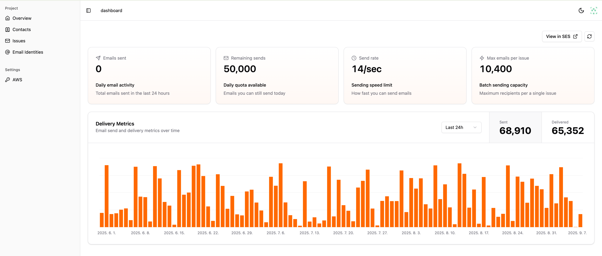

Email For Indiehackers is a cost-effective email solution that leverages your own AWS account to send emails at Amazon's rock-bottom rates. No markup, no hidden fees - just $0.1 per 1,000 emails.

## Features

- 📝 Notion-Style Email Editor - Design beautiful emails as easily as writing a Notion.
- ✉️ Smart Rate Limiting - Automatically adheres to AWS SES sending limits and optimizes delivery timing.
- 📇 Manage Millions of Contacts - Import millions of contacts in minutes, not hours.
- 📊 Monitoring - Monitor email performance intuitively.

## Get Started

Visit [https://www.emailforindiehackers.com](https://www.emailforindiehackers.com) to get started.

## Need Help?

- GitHub issue - feature requests or bug reports.
- GitHub discussion - general questions, best practices, community showcase.

---

- $ Love Email For Indiehackers?
- ⭐️ Click the star button
