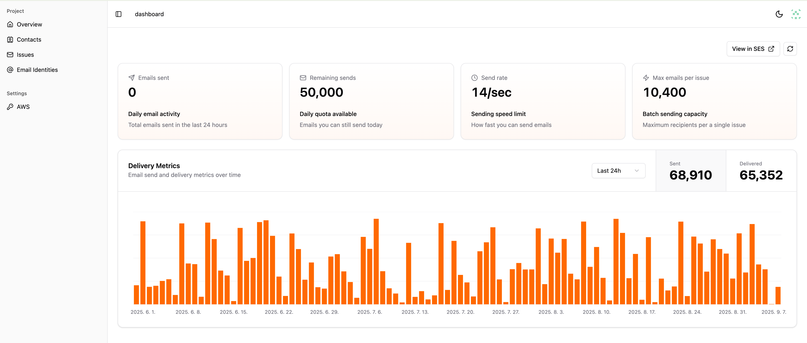

**Hacking the Cost of Email Marketing!**

Send emails at 100x lower cost with _AWS SES_. Built for bootstrappers who count every dollar.

## Features

- 📝 Notion-Style Email Editor - Design beautiful emails as easily as writing a Notion.
- ✉️ Smart Rate Limiting - Automatically adheres to AWS SES sending limits and optimizes delivery timing.
- 📇 Manage Millions of Contacts - Import millions of contacts in minutes, not hours.
- 📊 Monitoring - Monitor email performance intuitively.

## Get Started

Visit [https://www.emailforindiehackers.com](https://www.emailforindiehackers.com) to get started.

## Need Help?

- [GitHub issue](https://github.com/email-for-indiehackers/.github/issues) - feature requests or bug reports.
- [GitHub discussion](https://github.com/email-for-indiehackers/.github/discussions) - general questions, best practices, community showcase.

---

- ❤️ Love Email For Indiehackers?
- ⭐️ Click the star button
